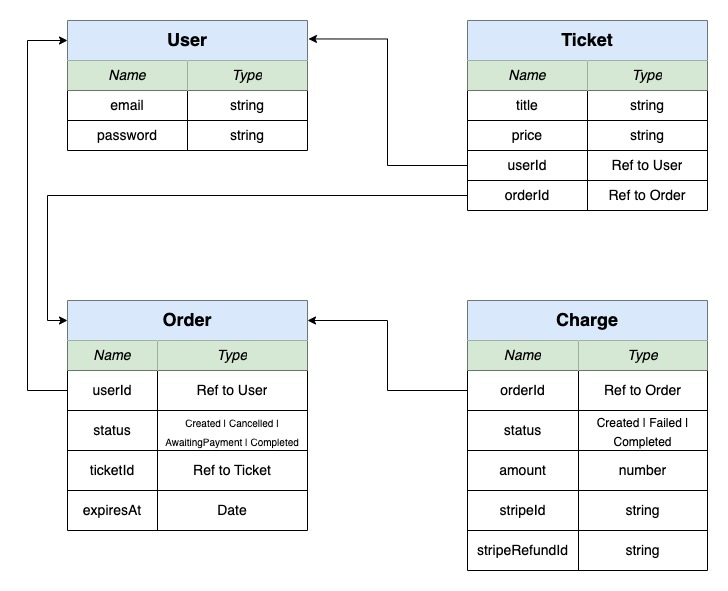
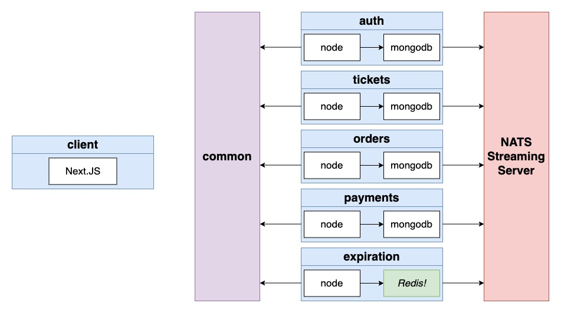

# Build a Ticketing App
- Users can list a ticker for an event (convert, sports) for sale
- Other users can purchase this ticket
- Any user can list tickets for sale and purchase tickets
- When a user attempts to purchase a ticket, the ticket is 'locked' for 15 minutes. The user has 15 minutes to enter their payment info.
- While locked, no other user can purchase the ticket. After 15 minutes, the ticket should 'unlock'
- Ticket prices can be edited if they are not locked

## Database


## How to properly use Object.setPrototypeOf()


## Services
Introduce about main services we plan to build in this project!

### auth
Everything related to user as: signup/ signin/ signout

### tickets
Ticket creation/ editing. Knows whether a ticket can be updated

### orders
Order creation/ editing

### expiration
Watches for orders to be created, cancels them after 15 minutes

### payments
Handle credit card payments. Cancels orders if payments fails, completes if payment succeeds

## Events
- user-service
  - UserCreated
  - UserUpdated
- orders-service
  - OrderCreated
  - OrderCancelled
  - OrderExpired
- ticket-service
  - TicketCreated
  - TicketUpdated
- payments-service
  - ChargeCreated

## Project Architecture


### Steps to create Nodejs service with typescript
Install typescript at global
```
npm install typescript -g
```

Install typescript to Node.js project with command
```
npm install typescript ts-node-dev express @types/express
```

Init the tsconfig file in service
```
tsc --init
```

If you did not see your server restart after changing the index.ts file, do the following
- Open the package.json file in the ‘auth’ directory
- Find the 'start' script
Update the start script to the following:
```
ts-node-dev --poll src/index.ts
```

### Host Files and Security Warning
When run ingress services and use to browse at Chrome, you'll receive SSL error at locally because ```Kubernetes ingress controller Fake certificate``` so that time you tap-out to area of error content description and type keyword ```thisisunsafe```, Chrome will be bypass the error and return response.

### Setup Kubernetes using Google Cloud on Docker Desktop
#### Initial Setup
Already with an Docker Desktop installed on your machine (Windows, MacOS, Linux, etc)

Create an free (only for testing purpose) on Google Cloud and get $300 free credits at link [https://cloud.google.com/free]

Create a new Google Cloud project called "ticketing-dev" at link [https://console.cloud.google.com/projectcreate]

#### Steps to config Google Cloud Kubernetes context on your machine
The 1st time, make sure you installed Google Cloud SDK on your machine at link [https://cloud.google.com/sdk/docs/install] (prefer installed python3 previous).

Run this command to make sure gcloud SDK installed successfully ```gcloud```

The 2nd step, we need login to our registered free google cloud account at some previously steps with this command ```gcloud auth login```, and we chooose the right google account and allow to grant fully the request permissions as it required. After done, close the browser tab and back to commandline tool to do next steps.

- We choose option (2) to create a new gcloud configurations if this absolutely new project. In case we need reconfig google because some reasons, we choose the option (1).

- We choose the project ID need to connect too, in this case it 's "ticketing-dev-*"

- We choose the region to manually config with "Y" option, in this case it's (7) because we use `us-central-1c` as regional configure for out project before.

- The final step, we choose the account which will use to control/ grant command for this settings.

After done to init the setting of project by gcloud SDK on your location repository, we go to next steps to connect its context to Docker Desktop to switch or manage kubernetes easy.
- At the 1st time **if you still not install any google cloud kubectl component**, quit your docker desktop run this command to install it ```gcloud components install kubectl```
- After finish install or had gcloud kubectl existed on your docker desktop, run this command to get the project's kubernetes cluster context arn ```gcloud container clusters get-credentials <cluster-name>```
- After done check if same bellow output, result is successfully and your docker desktop had its context
```
Fetching cluster endpoint and auth data.
kubeconfig entry generated for ticketing-dev.
```

#### Update the skaffold config to build and `synchronize` to Google Cloud
We do some bellow steps to make sync, build, config and deploy to Kubernetes at Google Cloud.
- Enable Google Cloud Build (It's very quick than your old machine!!!)
- Update the `skaffold.yaml` file to use Google Cloud Build (instead of your local machine)
- Setup ingress-nginx on your Google cloud cluster at kubernetes.github.io/ingress-nginx (another ingress `nginx-ingress` is totally other different, we not use it at this example)
- Update your hosts file again to point to the remote cluster
- Restart skaffold

##### Enable Google Build
We find at the left-side menu of project dashboard and go to Cloud Build and enable it.

##### Update Skaffold to connect to Google Cloud
After enabled, edit skaffold.yaml from
```
build:
  local:
    push: false
```

to new one:

```
build:
  local:
    push: false
  googleCloudBuild:
    projectId: <project-id>
```

Update the artifacts to google cloud build format ```us.gcr.io/<project-id>/<service-name>```. Ex: **us.gcr.io/ticketing-dev-366408/auth**

Also take away the code in skaffold as
```
build:
  # local:
  #   push: false
```

After done for skaffold file update, we need to reconfig the image in infra/*-depl.yaml file to also use image from Google cloud

##### Setup ingress-nginx on Google Cloud Cluster
Open this link [https://kubernetes.github.io/ingress-nginx/deploy/] and find to config guideline of Google Cloud at section #GCE-GKE

At Section #Quick start, copy and run the command as bellow to install kubectl control plane
```
kubectl apply -f https://raw.githubusercontent.com/kubernetes/ingress-nginx/controller-v1.4.0/deploy/static/provider/cloud/deploy.yaml
```

##### Update hosts file to connect to cluster remote
Open Google cloud console of your project and find to choose "Load balancer" inside menu "Network services". Click to default Load balancer default record and copy the IP V4 address.

Open your /etc/hosts file and update IPV4 of domain "ticketing.dev"

##### Run skaffold on our cluster remote
You need to set the default credential before can use Cloud build, use this command
```
gcloud auth application-default login
```

## Difficulty in Error Handling
1. We must have a consistently structured response from all servers, no matter what went wrong.
- Write an error handling middleware to process errors, give them a consistent structure, and send back to the browser.

2. A billion things can go wrong, not just validation of inputs to a request handler. Each of these need to be handled consistently.
- Make sure we capture all possible errors using Express's error handling mechanism (call the 'next' function!)

## Handle async Error throw in Nodejs
At normal case support by native Nodejs we can use like this code
```
app.all('*', async (req, res, next) => {
  next(new NotFoundError());
});
```

To easy to use, we also can install lib called `express-async-errors` from npmjs and use follow the readme
```
const express = require('express');
require('express-async-errors');
const User = require('./models/user');
const app = express();
 
app.get('/users', async (req, res) => {
  const users = await User.findAll();
  res.send(users);
});
```